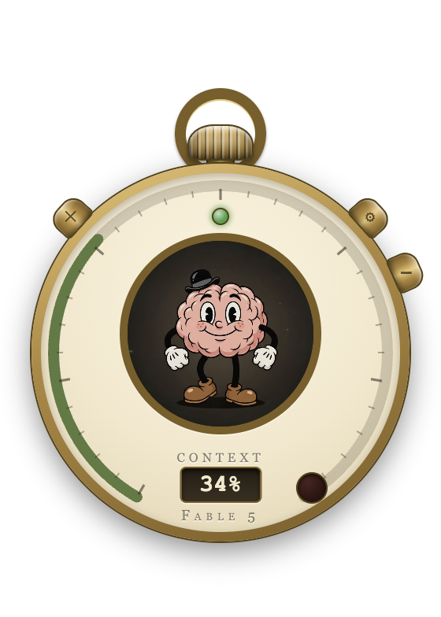

# Braincell 🧠⌚

**A pocket-watch Context Meter for Claude Code.** Braincell sits on your desktop like a small brass instrument and shows the health of your current Claude Code session at a glance — context pressure, model, activity, errors — with a one-press **compact**.

<p align="center">
  
</p>

## What it does

- **Context Meter** — the bezel arc fills as your session's context window fills, colored by pressure (green → amber → red). The aperture shows the exact %. The denominator is the model's *real* window (1M models read correctly).
- **Mascot** — a rubber-hose brain in the porthole whose mood tracks your session: smart, sweating, fried.
- **Crown = `/compact`** — press the winding crown to compact the session.
- **Caseback** — flip the watch over for your recent sessions (with live titles), Clear, and settings.
- **Fob mode** — minimize to a slim always-on-top capsule: gauge, %, compact.
- **Auto-detects sessions** — reads Claude Code's local transcripts (`~/.claude/projects`); follows the latest active session, or pin one.

## Watching vs. Wired

- **WATCHING** (default) — read-only monitoring of any session, from any Claude Code surface (terminal, desktop app, IDE). No control possible.
- **WIRED** — sessions launched through Braincell's wrapper get live controls: Compact and Clear are injected over a local socket (whitelisted commands only, never keyboard automation).

**Auto-wire** makes every new `claude` you launch in a terminal start wired: it adds one marker-guarded block to your shell rc that sources `~/.braincell/shim.sh`. Escape hatch: `BRAINCELL_DISABLE=1 claude`. Uninstall anytime from the caseback toggle — the block is removed cleanly.

## Download & install (macOS)

1. Grab the latest `Braincell-darwin-arm64-<version>.zip` from [Releases](../../releases).
2. Unzip, drag **Braincell.app** to Applications.
3. First launch: the build is not notarized yet, so macOS will claim the app **“is damaged and can’t be opened.”** It isn’t — that’s Gatekeeper’s message for unsigned downloads (right-click → Open does *not* bypass it). Clear the quarantine flag once, then open normally:
   ```sh
   xattr -cr /Applications/Braincell.app
   ```

Requirements: Apple Silicon Mac (build from source for Intel), [Claude Code](https://claude.com/claude-code), and Node.js on your PATH (only needed for wired mode).

## Privacy & safety

- Watching is **read-only** — Braincell only reads local transcript files.
- Control happens **only** through the wrapper's local socket (`~/.braincell/wired`, `0600` perms), with a whitelist: `/compact`, `/clear`, `/model`. No arbitrary commands, no keystroke injection, no terminal focus stealing.
- Nothing leaves your machine.

## Development

```sh
yarn install --ignore-engines
yarn start          # dev app (vite + electron-forge)
yarn typecheck && yarn lint
yarn make           # distributable → out/make/
```

Dev builds expose a loopback-only visual-check server (`/capture`, `/key`, `/click`) and a CDP port for DevTools tooling — both absent in packaged builds.

## License

[MIT](LICENSE)
